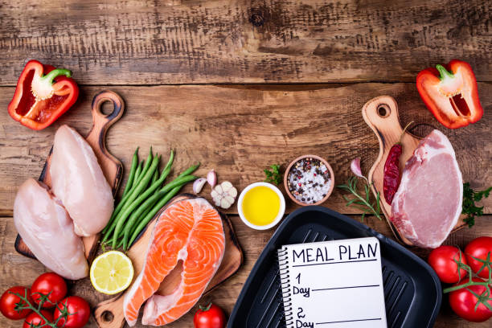

<h1># Meal Planner</h1>

## Description 
A personalized meal and wine planner for Date night and other special events.

An app allowing users to find a recipe based on 3 criteria: cuisine type, protein type and a selection of dietary restrictions. The user is able to choose from a selection of wines that pair well with their meal. When finished selecting a recipe and wine, the user is able to store their recipes to view later. 

 # Technology 

This application uses HTML, CSS, and JavaScript, as well as the Bootstrap CSS library. It uses the Spoonacular and Edamam APIs.

<h3>APIs:</h3>
-  <a href="https://www.edamam.com/">Edamam</a> creates recipe options specified by user critera.
  
-   <a href="https://spoonacular.com/food-api">Spoonacular</a> presents wine pairing selections for each meal. 

# Acceptance Criteria

-   Easy user interface.
-   Ability to create recipes based on a user search inputs.
-   Ability to match wines with recipes chosen from user search inputs.

# Status
Completed

# URL
[Meal Planner Live Page](https://noahneville.github.io/Meal-Planner/)

# Mock Up
The following image shows the web application's appearance and functionality:

